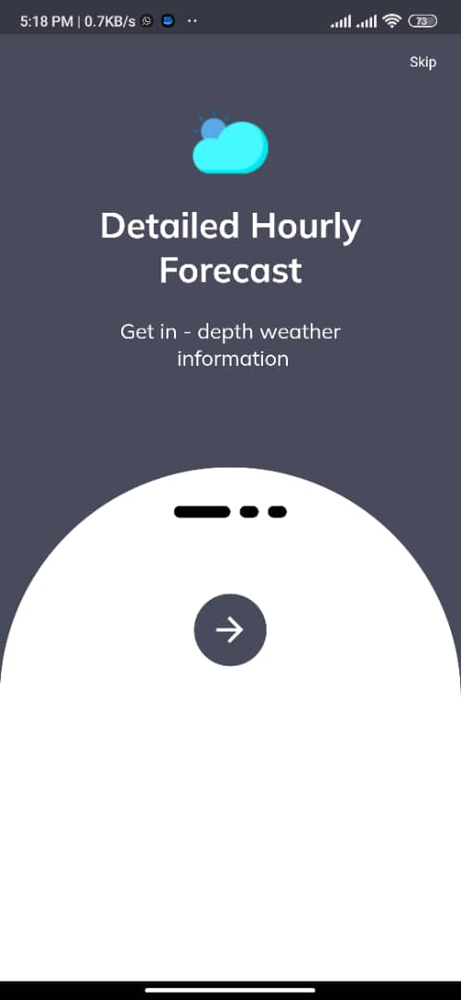

# foodcourt

`task` : `Flutter Project Based Code`

`Purpose of this Project`:
- This project is designed to satisfy the requirement of an interview.

`Task includes`
- Provide 15 cities (from this listhttps://simplemaps.com/data/ng-cities) for the user to choose to check theweather condition.
- The weather data display will change according to the selection.
- Display 3 cities (ref: stated in Basic Requirement 1) weather data in a carousel/tab view.
- Allow users to add/remove cities in the carousel/ tab view. The city selection can refer to: https://simplemaps.com/data/ng-cities
- Cities in the carousel should be persisted. Once the app is killed and opened back, the list of cities is still the same.
- A feature to use “Current Location” to display the weather information. This will detect the user's currentlocation, get the geolocation, and call the API using longitude and latitude.

`State Management Architecture Used`: `Provider and GetX`

`Execution Process`

`Provide 15 cities (from this listhttps://simplemaps.com/data/ng-cities) for the user to choose to check the weather condition`
This was acheived by extracting 15 different cities from the above link and creating a list to add all the cities to be used during the execution of the application.

`The weather data display will change according to the selection.`
The List been created from the extraction in step 1 is been displayed into a ListView to get it listed for the user to choose the city they desired to know the weather condition,
the data desired to user is queryed from https://openweathermap.org/ through the provided api which was invoked through http package provided by flutter 

`Display 3 cities (ref: stated in Basic Requirement 1) weather data in a carousel/tab view`
This functionality was achieved with communication with an Api endpoint to request for weather forecast data provided by https://openweathermap.org/
and these data are been requested with http, the point of connection was established and data communication is been done.

`Allow users to add/remove cities in the carousel/ tab view. The city selection can refer to: https://simplemaps.com/data/ng-cities || Cities in the carousel should be persisted. Once the app is killed and opened back, the list of cities is still the same`
Using the carousel/tab view, data were displayed to the users with the option of adding and removing the items themselves, Hive db was used to persist the data of the items the user adds, which gives the user the leverage to add their favourite city for checking weather forecast

`A feature to use “Current Location” to display the weather information. This will detect the user's currentlocation, get the geolocation, and call the API using longitude and latitude.`
this feature was achieved by using the geocoding and geolocator packages, to access the user location which strongly depends on the user agreeing to share their location and with the lat and lng of their location, they are able to see the weather condition of their location 

### Screenshots

|  | 

|  | 

|  |

| 

## How it works
- The application needs to load the weather data from the server(through api) through the internet to display to the user.
- From the splash screen to the onboarding page where information about the application is displayed to the user
- The next page gets to display the list of cities to the user, the user can click on any of the city to explore their current weather condition
- Viewing the weather condition of a city on a particular page still gives you leverage of getting to know about the condition of other city by adding the city to carousel display at the top of the page, this city added is persisted(user can close the app and open it back to access what they have added)
- On the Home page there is a button that allow the user to see the weather condition of the 3 most popular cities in nigeria.

**Client:** 
`Dart` as `Logic language`, 
`Dart` as `ui Language`,
`HiveDatabase` as `local database`,
`http` to `Handle HttpRequest`
`geocoding, geolocator` as `handle permissions`
`provider & getX` to `State Management`,
`getStorage` to `Handle mini storage`

`How to Clone this Project`
- Open your terminal or command prompt and navigate to the directory where you want to clone the app.

- Use the git clone command to clone the app from the repository. For example, if the app is located in a GitHub repository, you can use the following command: `git clone https://github.com/username/repo.git`

- Replace username with the GitHub username of the app's author and repo with the name of the repository.

- Once the app is cloned, navigate to the app's directory using the cd command: `cd repo`

- If the app uses external dependencies, use the flutter pub get command to download and install them.

- Finally, you can run the app using the flutter run command. If the app requires a specific device or emulator, specify it using the -d flag. For example: `flutter run -d emulator-1`

- Replace emulator-1 with the name of the emulator you want to use.

- That's it! You should now have a cloned copy of the Flutter app running on your local machine.
## 
